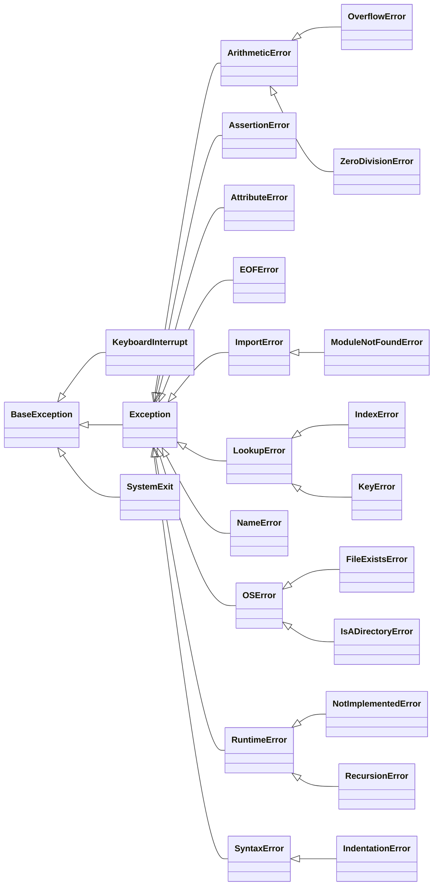

# CS 1440 Assignment 6: Recursive Web Crawler - Project Requirements

Use 3rd-party libraries to quickly produce a functioning web crawler.  Rely on Exception Handling to deliver a safe and robust solution to our client.  Deliver a well-tested and documented programming product by the end of the sprint.


*   [Software Libraries](#software-libraries)
*   [User's Manual](#users-manual)
*   [User Interface: Input](#user-interface-input)
*   [User Interface: Output](#user-interface-output)
*   [Handle Exceptions](#handle-exceptions)
*   [The `crawl()` Function](#the-crawl-function)
*   [Absolute and Relative URLs](#absolute-and-relative-urls)
*   [Testing Your Crawler](#testing-your-crawler)


## Software Libraries

As Fred Brooks Jr. writes in *No Silver Bullet*, one of the biggest advancements of modern software engineering is the availability of libraries of pre-written code.  Reusing well-crafted code enables us to create bigger, more reliable and more featureful systems faster and more cheaply than writing every line of code from scratch.  Software engineers spend a considerable fraction of their time learning how to incorporate new libraries into their projects.

I have included demo programs under the `demo/` directory to help you learn the libraries needed in this assignment.

### [urllib.parse](https://docs.python.org/3.9/library/urllib.parse.html) Python's Standard URL Parsing Library

*This library is part of the Python standard distribution and does not need to be installed manually.*

The `urlparse()` function can be used to evaluate whether a URL is absolute and thus suitable for use with `requests.get()`.

```python
from urllib.parse import urlparse
parsed = urlparse('https://cs.stanford.edu/~knuth/news.html?query=The Art of Computer Programming#this-is-a-fragment')
print(parsed)

ParseResult(scheme='https', netloc='cs.stanford.edu', path='/~knuth/news.html', params='', query='query=The Art of Computer Programming', fragment='this-is-a-fragment')
```

See the [urlparse.py program](../demo/urlparse.py) for a more complete demonstration.


The `urljoin()` function combines an absolute URL with a relative URL,
resulting in a new absolute URL.  When two absolute URLs are joined, the paths
are matched as far as they are the same.

```python
from urllib.parse import urljoin
absPlusRel = urljoin('https://cs.stanford.edu/', '~knuth/musings.html')
print(absPlusRel)

https://cs.stanford.edu/~knuth/musings.html

absPlusAbs = urljoin('https://cs.stanford.edu/~knuth/vita.html', 'https://cs.stanford.edu/~knuth/graphics.html')
print(absPlusAbs)

https://cs.stanford.edu/~knuth/graphics.html
```

See the [urljoin.py program](../demo/urljoin.py) for a more complete demonstration.

This library also includes a function called `urldefrag()` that strips fragments from a URL.  It works like this:

```python
from urllib.parse import urldefrag
url = "https://docs.python.org/3/library/urllib.parse.html#urllib.parse.urldefrag"
defragged = urldefrag(url)
print(f"defragged = {defragged.url}")
```

You can use it if you want, but it is just a fancier way to do this:

```python
url = "https://docs.python.org/3/library/urllib.parse.html#urllib.parse.urldefrag"
defragged = url.split('#')[0]
print(f"defragged = {defragged}")
```


### 3rd Party Libraries

You only need these libraries to complete this assignment.  In fact, your
program should **not** use any other libraries because of the extra work it
creates for the graders.

These libraries can be installed on your system by navigating into the repository in a command shell and running

```bash
$ python -m pip install --user -r requirements.txt
```

Be sure to note in your User's Manual that your program requires these software libraries.


### [Requests](http://docs.python-requests.org/en/master/) HTTP Library

A simple interface to making HTTP requests from a Python program.

```python
import requests
r = requests.get('http://checkip.dyndns.com')
print(r.text)

<html><head><title>Current IP Check</title></head><body>Current IP Address: 13.103.37.144</body></html>
```

See the [request.py program](../demo/request.py) for a more complete demonstration.


### [BeautifulSoup](https://www.crummy.com/software/BeautifulSoup/bs4/doc/) HTML Parsing Library

BeautifulSoup uses a pluggable HTML parser to parse a (possibly invalid)
document into a tree representation.  BeautifulSoup provides methods and
Pythonic idioms that make it easy to navigate, search, and modify the parse
tree.

```python
from bs4 import BeautifulSoup
soup = BeautifulSoup("<html><head><title>Current IP Check</title></head><body>Current IP Address: 13.103.37.144</body></html>")
text = soup.find('body').text
print(text)

Current IP Address: 13.103.37.144
```

See the [beautifulsoup.py program](../demo/beautifulsoup.py) for a more complete demonstration.

## User's Manual

*   A **first draft** written at or before the `designed` commit
    *   Describe your *expectation* of how the program will work, from the user's perspective
    *   If the first draft of the manual is not present, you will receive *at most* half credit
*   A **final draft** written at or before the `deployed` commit
    *   Describe how your program *actually* works

Write your instructions with the end-user in mind; your audience is not a programmer.
You may assume the user can use the command line and knows how to run Python and pip on their computer.
A good manual does not need to be long, but covers these points:

*   **Setup steps** the user must complete before they can use the program
    *   You may simply tell the user to run `python -m pip install --user -r requirements.txt`
*   Explain **how to run** the program
    *   What is the name of the program?
    *   Which directory should the user start in?
    *   What arguments does the program take?
        *   Explain the difference between *absolute* and *relative* URLs
        *   Explain what effect the maximum recursion depth has
        *   Which arguments are optional, and what is the default behavior when they are not specified?
*   Describe what the user sees when the **program runs correctly**
*   Show **common errors** when the program is used incorrectly
    *   Contrast valid and invalid inputs


## User Interface: Input

*   When **zero** command line arguments are given:
    *   Display a *simple* usage message explaining what arguments can be given to the program and immediately exit
*   When **one** command line argument is given
    *   The first argument is the `StartingURL` that your `crawl()` function will visit first
        *   `StartingURL` must be an *absolute URL* that begins with either `http://` or `https://`
    *   Print an error message to `sys.stderr` and quit when this URL is not *absolute*, or does not begin with `http://` or `https://`
        *   This must be your own error message; it is wrong if the `requests` library raises an exception
        *   You do not need a `try/except` block to accomplish this; instead, inspect the `ParseResult` object after using `urllib.parse()` on the URL
*   When **two** command line arguments are given:
    *   The first argument is `StartingURL`, as explained above
    *   The second argument is `MaximumDepth`, a *positive* integer
        *   This parameter controls how far from the `StartingURL` the crawler will travel, it is *not* the maximum number of pages that will be visited
        *   This is the same as the maximum depth of recursion that `crawl()` will reach
    *   When this parameter is *not supplied* or *is not a positive integer*, set `MaximumDepth` to `3`
        *   The program **does not** crash or exit when an invalid `MaximumDepth` is given
*   Extra arguments are ignored
    *   The program does not exit
    *   No message is displayed


## User Interface: Output

*   Before calling `crawl()` the first time, print a message stating the starting URL and maximum crawl depth for this run
*   Call `crawl()` and print all links visited from `StartingURL` to `MaximumDepth`
    *   A URL is visited when `requests.get()` is called on it
    *   Your program **must not** print a URL that is not visited
    *   Your program **must not** print the same URL multiple times
*   Visited links are printed with 4 spaces of indentation **per level of recursion**
    *   `StartingURL` is **depth 0**, and is printed *without* indentation
    *   The links found on this page are **depth 1**, and are printed with **4 spaces of indentation**
    *   When the program reaches a distance of 3 links, visited links are displayed with `4 * 3 =` **12 spaces of indentation**
    *   All unvisited links found at `MaximumDepth` are *fetched* with `requests.get()` and their URLs are printed, but **none** of the links found in these pages are visited nor printed!
*   Before the program exits, print a report of the program's activity; the report includes:
    *   the amount of time the program ran
    *   the number of unique links visited
    *   The report is printed even when the program quits on a `KeyboardInterrupt` (e.g. by pressing `Ctrl-C`)
        *   Make the report mention that the user terminated the program early
        *   The count of visited sites may be inaccurate when `Ctrl-C` is pressed; this is not a problem
*   When a problem is encountered in the `requests` and `BeautifulSoup4` libraries, an error message is printed with the current amount of indentation
*   **10 point penalty** if any `print("TODO...")` statements are left in the program
    *   This becomes a **20 point penalty** if a `print("TODO...")` statement is *repeated*


### When no parameters are supplied

```
$ python src/crawler.py
Error: no URL supplied
```

### When the program detects that a relative URL is given instead of an absolute URL

```
$ python src/crawler.py cs.usu.edu
Error: Invalid URL supplied.
Please supply an absolute URL to this program
```

### A correct invocation of the program
*Note: I specified following 0 links, so only the initial website's URL is displayed*

```
$ python src/crawler.py https://cs.usu.edu 0
Crawling from https://cs.usu.edu to a maximum distance of 0 links
https://cs.usu.edu
Visited 1 unique page in 0.2057 seconds
```

*For the following examples your output may vary from mine*

What websites you are able to find will depend upon many factors outside of our
control.  Our program is running loose on the internet, which means that it is
crawling over a vast network that is constantly undergoing change, and which
can present different pathways depending upon when and how you connect to it.

*   Don't expect that your program's output will exactly match mine!
*   Don't be surprised if your program's output is different today than it was yesterday, even though you didn't change anything.
*   The run time and count of unique visited sites *will be different from yours*


### Crawling to pages only 1 link away

```
$ python src/crawler.py https://cs.usu.edu 1
Crawling from https://cs.usu.edu to a maximum distance of 1 link
https://cs.usu.edu
    http://www.usu.edu
    http://usu.edu/azindex/
    http://usu.edu/myusu/
    https://cs.usu.edu/about/index.php
    https://cs.usu.edu/news/main-feed/2018/awards-banquet.php
    https://engineering.usu.edu/news/main-feed/2019/a-pin.php
    https://engineering.usu.edu/news/main-feed/2019/student-awards.php
    https://cs.usu.edu/students/resources/microsoft-imagine.php
    https://cs.usu.edu/files/pdf/department-map.pdf
    https://appcamp.usu.edu
    https://cs.usu.edu/students/resources/why-comp-sci.php
    https://cs.usu.edu/employment/
    https://www.youtube.com/watch?v=CRYfNVlg4lE&feature=youtu.be
    http://a.cms.omniupdate.com/10?skin=usu&account=usu&site=Engineering_CS&action=de&path=/index.pcf
...
Visited 366 unique pages in 1.5355 seconds
```

### Another correct invocation, this time letting the program use its default distance of 3 links

Notice the levels of indentation in the output that clearly indicate the depth
of recursion.  Your program must follow this format:

*   The initial URL supplied on the command line is at level 0
*   For each level of depth add 4 spaces
*   Use spaces, not tabs

Which URLs your program prints don't need to match this example.  Your program
may print a different set of URLs in a different order than my program did.
What links your program finds depends on circumstances outside of our control.

Today my program visited 418 URLs and took almost 4 minutes from my office in
Old Main.  Last semester this same command visited 939 URLs and only took 2.3
seconds when run from my home network.  Your results will vary with your
network conditions.

Your program may take an *extremely* long time to finish.  This is fine; you
are not being graded on how fast your solution is.

The presence of error messages/exceptions is allowed provided that your program
does *not* crash as a result of them.


```
$ python src/crawler.py http://cs.usu.edu
Crawling from http://cs.usu.edu to a maximum distance of 3 links
https://cs.usu.edu
    http://www.usu.edu
        http://www.usu.edu/azindex/
            https://my.usu.edu
            http://directory.usu.edu
            http://www.usu.edu/about/
            http://usueastern.edu/about/
            http://www.usu.edu/aa/
            http://www.usu.edu/calendar/academic.cfm
            http://catalog.usu.edu/content.php?catoid=4&navoid=546
Requests or BeautifulSoup ctor() HTTPSConnectionPool(host='catalog.usu.edu', port=443): Max retries exceeded with url: /content.php?catoid=4&navoid=546 (Caused by SSLError(SSLError("bad handshake: Error([('SSL routines', 'tls_process_server_certificate', 'certificate verify       failed')])")))
            http://www.usu.edu/arc/tutoring/
            http://www.usu.edu/arc/
            http://banner.usu.edu
            https://id.usu.edu/Personal/Lookup
Requests or BeautifulSoup ctor() HTTPSConnectionPool(host='myid.usu.edu', port=443): Max retries exceeded with url: / (Caused by SSLError(SSLError("bad handshake: Error([('SSL routines', 'tls_process_server_certificate', 'certificate verify failed')])")))
    ...
Visited 418 unique pages in 228.7696 seconds
```


### Crawling to 5 links

Be careful when you test depths beyond 2 or 3 on the internet.  Depending on
what site you aim your crawler at, this could take a *very* long time!  It is
always safe to use the included [testing server](../demo/testing_server.py).

This example instructs the testing server to create one branch of pages up to
depth 10, but our crawler quits after it sees the 4th layer:

```
$ python src/crawler.py http://127.0.0.1:8000/breadth=1/depth=10 5
Crawling from http://127.0.0.1:8000/breadth=1/depth=10 to a maximum distance of 5 links
http://127.0.0.1:8000/breadth=1/depth=10
    http://127.0.0.1:8000/
        http://127.0.0.1:8000/deadend
        http://127.0.0.1:8000/a
            http://127.0.0.1:8000/aa
                http://127.0.0.1:8000/aaa
                    http://127.0.0.1:8000/aaaa
Visited 7 unique pages in 0.1069 seconds
```

Count the levels of indentation.  The page at the URL given in the command line is at depth 0.  The level 4 'a' page (`/aaaa`) is indented 5 layers deep.  Including the `/deadend` page brings the total of pages visited to 7.

The output of the testing server from this run looks like this:

```
Serving from http://127.0.0.1:8000/
Press Ctrl-C or visit http://127.0.0.1:8000/shutdown/ to quit

Server: Setting breadth to 1
Server: Setting depth to 10
Server will shutdown in 3 seconds...
127.0.0.1 - - [29/Mar/2023 22:30:14] "GET /breadth=1/depth=10 HTTP/1.1" 302 -
127.0.0.1 - - [29/Mar/2023 22:30:14] "GET / HTTP/1.1" 200 -
127.0.0.1 - - [29/Mar/2023 22:30:14] "GET / HTTP/1.1" 200 -
127.0.0.1 - - [29/Mar/2023 22:30:14] "GET /deadend HTTP/1.1" 200 -
127.0.0.1 - - [29/Mar/2023 22:30:14] "GET /a HTTP/1.1" 200 -
127.0.0.1 - - [29/Mar/2023 22:30:14] "GET /aa HTTP/1.1" 200 -
127.0.0.1 - - [29/Mar/2023 22:30:14] "GET /aaa HTTP/1.1" 200 -
127.0.0.1 - - [29/Mar/2023 22:30:14] "GET /aaaa HTTP/1.1" 200 -
Server will shutdown in 2 seconds...
Server will shutdown in 1 second...
5 pages were visited exactly once

1 page was not visited at all

Restarting...
```

This says that *1 page was not visited at all*.  This refers to the link `/aaaaa` (5 a's) that was seen on the final visited page `/aaaa` but not followed.  You may notice that the home page `/` was visited twice in a row; this is a side-effect of how the server works, and is not evidence of a bug in the crawler.


### Exhausting all possibilities

This command visits the same testing server configuration as before, but tells the crawler that it can go as deep as *20* links.  This is more links than the server will create, which makes the crawler quit for a lack of new pages to visit.

```
$ python src/crawler.py http://127.0.0.1:8000/breadth=1/depth=10 20
Crawling from http://127.0.0.1:8000/breadth=1/depth=10 to a maximum distance of 20 links
http://127.0.0.1:8000/breadth=1/depth=10
    http://127.0.0.1:8000/
        http://127.0.0.1:8000/deadend
        http://127.0.0.1:8000/a
            http://127.0.0.1:8000/aa
                http://127.0.0.1:8000/aaa
                    http://127.0.0.1:8000/aaaa
                        http://127.0.0.1:8000/aaaaa
                            http://127.0.0.1:8000/aaaaaa
                                http://127.0.0.1:8000/aaaaaaa
                                    http://127.0.0.1:8000/aaaaaaaa
                                        http://127.0.0.1:8000/aaaaaaaaa
                                            http://127.0.0.1:8000/aaaaaaaaaa
Visited 13 unique pages in 0.2104 seconds
```

From the server's perspective:

```
Serving from http://127.0.0.1:8000/
Press Ctrl-C or visit http://127.0.0.1:8000/shutdown/ to quit

Server: Setting breadth to 1
Server: Setting depth to 10
Server will shutdown in 3 seconds...
127.0.0.1 - - [29/Mar/2023 22:36:33] "GET /breadth=1/depth=10 HTTP/1.1" 302 -
127.0.0.1 - - [29/Mar/2023 22:36:33] "GET / HTTP/1.1" 200 -
127.0.0.1 - - [29/Mar/2023 22:36:33] "GET / HTTP/1.1" 200 -
127.0.0.1 - - [29/Mar/2023 22:36:33] "GET /deadend HTTP/1.1" 200 -
127.0.0.1 - - [29/Mar/2023 22:36:33] "GET /a HTTP/1.1" 200 -
127.0.0.1 - - [29/Mar/2023 22:36:33] "GET /aa HTTP/1.1" 200 -
127.0.0.1 - - [29/Mar/2023 22:36:33] "GET /aaa HTTP/1.1" 200 -
127.0.0.1 - - [29/Mar/2023 22:36:33] "GET /aaaa HTTP/1.1" 200 -
127.0.0.1 - - [29/Mar/2023 22:36:33] "GET /aaaaa HTTP/1.1" 200 -
127.0.0.1 - - [29/Mar/2023 22:36:33] "GET /aaaaaa HTTP/1.1" 200 -
127.0.0.1 - - [29/Mar/2023 22:36:33] "GET /aaaaaaa HTTP/1.1" 200 -
127.0.0.1 - - [29/Mar/2023 22:36:33] "GET /aaaaaaaa HTTP/1.1" 200 -
127.0.0.1 - - [29/Mar/2023 22:36:33] "GET /aaaaaaaaa HTTP/1.1" 200 -
127.0.0.1 - - [29/Mar/2023 22:36:33] "GET /aaaaaaaaaa HTTP/1.1" 200 -
Server will shutdown in 2 seconds...
Server will shutdown in 1 second...
11 pages were visited exactly once

Restarting...
```


### Interrupted by Ctrl-C

When you press `Ctrl-C` while running a Python program, it receives a `KeyboardInterrupt` exception.  Ordinarily this causes the program to immediately exit, printing a stack trace on its way out.  Your crawler should instead catch this exception and print the time and number of unique pages visited, as it usually would when exiting.

```
$ python src/crawler.py http://127.0.0.1:8000/depth=10/breadth=10 10
Crawling from http://127.0.0.1:8000/depth=10/breadth=10 to a maximum distance of 10 links
http://127.0.0.1:8000/depth=10/breadth=10
    http://127.0.0.1:8000/
        http://127.0.0.1:8000/deadend
        http://127.0.0.1:8000/a
            http://127.0.0.1:8000/aa
                http://127.0.0.1:8000/aaa
                    http://127.0.0.1:8000/aaaa
                        http://127.0.0.1:8000/aaaaa
                            http://127.0.0.1:8000/aaaaaa
                                http://127.0.0.1:8000/aaaaaaa
                                    http://127.0.0.1:8000/aaaaaaaa
                                        http://127.0.0.1:8000/aaaaaaaaa
                                        http://127.0.0.1:8000/aaaaaaaab
                                        http://127.0.0.1:8000/aaaaaaaac
                                        http://127.0.0.1:8000/aaaaaaaad
                                        http://127.0.0.1:8000/aaaaaaaae
                                        http://127.0.0.1:8000/aaaaaaaaf
                                        http://127.0.0.1:8000/aaaaaaaag
^C
Exiting...
Visited 18 unique pages in 0.2783 seconds
```


## Handle Exceptions

*   Exception Handling protects the crawler from crashing when encountering broken web sites
    *   Exceptions raised by `requests.get()` or `BeautifulSoup` **should not** cause the program to terminate
    *   Instead, an error message is printed and the crawler **proceeds to the next website**
    *   You are **not** penalized if your program hangs on broken websites; there isn't much you can do about this
*   The program gracefully exits upon receipt of `KeyboardInterrupt` by displaying the activity report
    *   It is okay if your program occasionally needs `Ctrl-C` to be pressed a couple times for this to work
        *   The other libraries used by your program will sometimes catch and ignore `KeyboardInterrupt`, depriving your code a chance to respond to it
        *   If you press `Ctrl-C` often enough, you should be able to get your program's attention
    *   Position the `except KeyboardInterrupt:` clause so that the program stops instead of moving on to the next URL
        *   Read the starter code - there is a hint for you in there!
*   Do not *swallow* exceptions; report something about them!
    *   You *may* use the [`traceback`](https://docs.python.org/3/library/traceback.html) library to increase the detail of error messages

See the [exceptions.py game](../demo/exceptions.py) for a more complete demonstration.

### Exception Hierarchy

https://docs.python.org/3/library/exceptions.html#exception-hierarchy




## The `crawl()` Function

*   `crawl()` must be written as a **recursive** function
    *   This does not mean that `crawl()` cannot use a loop
    *   This means that each step away from `StartingURL` results in a new call to `crawl()`
    *   The return value of `crawl()` may be ignored
*   Use `requests.get()` to fetch HTML content from URLs
*   Use `BeautifulSoup` to find `<a>` tags in HTML content
*   From the `urllib.parse` library, use the functions `urlparse`, `urljoin` and `urldefrag` to manipulate URLs
    *   Fragments are stripped from URLs to avoid duplicate visits
        *   See [What URLs are "the same"?](#what-urls-are-the-same) for more information
*   `crawl()` "remembers" what URLs it has visited with a [set](https://docs.python.org/3/library/stdtypes.html#set)
    *   Python passes mutable data structures by [reference](https://realpython.com/python-pass-by-reference/#passing-arguments-in-python)
    *   This means that changes to the visited set that happen *inside* `crawl()` are visible *outside* of the function without returning it
    *   Any URL your program attempts to fetch with `requests.get()` is considered to be visited, regardless of whether `requests.get()` succeeds or fails
    *   Your program **must not** print a URL that is not visited
    *   Your program **must not** print the same URL multiple times
*   `crawl()` may not use global variables
    *   Modify `crawl()` to take more parameters, such as:
        *   `url`: an absolute URL
        *   `depth`: the current depth of recursion
        *   `maxdepth`: the maximum depth of recursion
        *   `visited`: a `set` of URLs which have already been visited
*   Supply a starting distance of `0` the first time `crawl()` is called
    *   In other words, the initial URL supplied from the command line is **depth 0**
*   You may supply an empty `set()` for the initial value of `visited`, or you can populate the set with some URLs to *never* visit
    *   One reason you might do this is to avoid websites that make your program behave badly.
*   Each time `crawl()` is called:
    *   If the current value of `depth` exceeds `maxdepth`, immediately return
    *   If the given URL has been `visited`, immediately return
    *   If the given URL is invalid, immediately return
        *   `requests.get()` works only with absolute HTTP/HTTPS URLs
    *   If everything is good
        *   Print out the URL passed in through the `url` parameter
            *   Refer to the `depth` parameter to see the current depth of recursion
            *   Use indentation to indicate the current depth of recursion.
            *   Print **four spaces** for each level of recursion (see the [sample output](Output.md))
            *   **Do not** print tabs `\t`; print **four spaces**
        *   Mark the url that is about to be visited as `visited`
            *   An attempt to visit a url counts as a visited url for our purposes; no need to try failed urls again later
        *   Use the **requests** library to fetch the webpage by `url`
        *   Print any exceptions that are raised and return from this invocation of `crawl()`.
            *   Your program *must not crash* when an unavailable resource is encountered.
        *   Scan the resulting HTML for anchor tags `<a>`.
        *   `for` each anchor tag:
            *   Check for an `href` attribute; if this anchor tag doesn't have one, `continue` to the next iteration of the loop.
            *   Discard the *fragment* portion of the URL, if present.
                *   One of the libraries utilized might have something to help with this...
            *   Determine whether the `href` attribute refers to an absolute URL.  If not, make it into an absolute URL by using the `urljoin()` function and the current value of `url`
                *   One of the libraries utilized might have something to help with this...
            *   Call `crawl()` again recursively with appropriate parameters
                *   Don't forget to increment `depth`!


## Absolute and Relative URLs

An absolute URL contains enough information by itself to locate a resource on a
network.  It includes, at minimum, a scheme followed by the token `://`
followed by a hostname.

The **scheme** (a.k.a. protocol) is the `http`, `https`, `ftp`, `telnet`, `ssh`,
etc. which may occur before the `://` token (when present).  This indicates how
the client program (i.e. your web browser or the `crawl.py` program) will
communicate with the server.

The **hostname** comes after the optional `scheme://` at the beginning of a URL and
before the next `/` character.  A hostname identifies a machine on the
internet.  The hostname may be a plain IP address or a human-friendly string
that can be resolved to an IP address.

Following the hostname may come the optional components **path**, **query
parameters** and/or **fragment**.

### Examples of Absolute URLs

*   `https://duckduckgo.com`
*   `https://gitlab.cs.usu.edu/erik.falor/cs1440-falor-erik-assn6/-/blob/master/instructions/README.md`
*   `https://usu.instructure.com/courses/547414/assignments/2698431?module_item_id=3503120`
*   `http://dwm.suckless.org/tutorial/#content`


### Examples of Relative URLs

*   `duckduckgo.com`
    -   A hostname only, no scheme
*   `erik.falor/cs1440-falor-erik-assn6/-/blob/master/instructions/README.md`
    -   No scheme nor hostname
*   `assignments/2698431?module_item_id=3503120`
    -   No scheme nor hostname, only a partial path
    -   The presence of query parameters don't affect whether this URL is absolute or not
*   `#content`
    -   A fragment-only relative URL which refers to back the same page it is found on
    -   A URL like this should be ignored by your program

Many resources presented on websites are referred to by a relative URL, which
leave off one or more of these components.  When a relative URL is encountered,
the client combines the corresponding information from the current document to
convert the relative URL into an absolute one.  Your `crawl()` function must
therefore know the URL of its current document so that it can substitute
missing information into relative URLs.

For example, if you point your program at `http://cs.usu.edu` and encounter a
link to `/articles.aspx`, your program will convert this to the absolute URL
`http://cs.usu.edu/articles.aspx` by means of the `urljoin()` function from the
`urllib.parse` library.


### Fragment Identifiers in URLs

A part of a URL occurring after a `#` symbol is known as a fragment, and refers
to a sub-section within a document.  Your program is concerned only with entire
documents; either a document has been visited or it has not.

Fragments should be removed from an absolute URL before checking whether it has
been visited before or not.

All relative URLs beginning with `#` refer to another location within the
current document.  Because your program should not visit the same document
twice, such URLs should be discarded.


### What URLs are "the same"?

You may find examples with your browser that don't match these rules.  These rules apply to this web crawler.

-   URLs with and without a trailing `/` are *different*
    -   e.g. your program treats `http://127.0.0.1:8000` and `http://127.0.0.1:8000/` as **different** sites
-   URLs beginning with `http://` and `https://` are *different*
    -   e.g. your program treats `http://cs.usu.edu` and `https://cs.usu.edu/` as **different** sites
-   URLs which differ only in their fragment are *the same*
    -   e.g. your program treats `http://127.0.0.1:8000`, `http://127.0.0.1:8000#hello` and `http://127.0.0.1:8000#goodbye` as **the same** site


## Testing Your Crawler

You need to turn this program loose on the internet to find out if it works.  To keep this program really simple, it does not honor the [Robots Exclusion Standard](https://www.robotstxt.org/).  `robots.txt` is a file found on servers which contains rules that an automated web crawler is supposed to follow.  Because your crawler doesn't look out for these files, this means that a visit by your crawler could be regarded as malicious.

So far, no DuckieCorp interns have gotten into trouble while working on this project.  To keep it that way, try to restrict your testing activities to

*   The [Testing Server](../demo/Using_the_Testing_Server.md)
*   https://cs.usu.edu
*   Websites that you personally operate
*   Websites that you have explicit permission to crawl

Of course, as your crawler visits these sites it will inevitably follow links to other sites outside of this set.  This is okay, and you won't get into trouble as long as your crawler's activities don't become noticeable to the site admin.

**TL;DR:** Don't hammer an unsuspecting site with an unreasonable amount of automated traffic.
